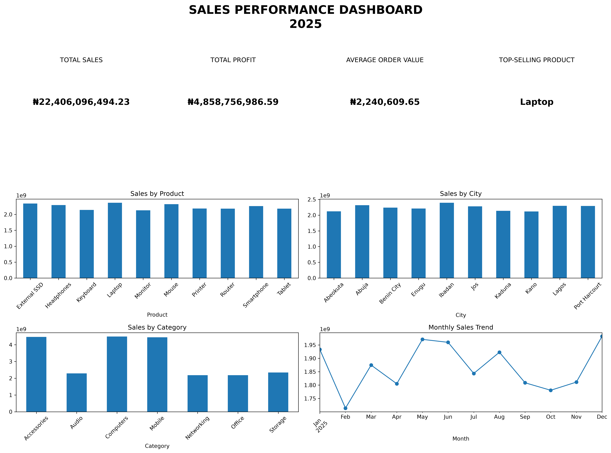

# sales-performance-analysis-python
Sales performance analysis and dashboard built with python, pandas and Matplotlib
## Project Overviw
This project analyzes 10,000 sales transactions to understand business performance, product performance, profitability and sales trends
the analysis was performed using python, pandas, and Matplotlib
## Business Questions
The project answers the following questions
What is the total sales revenue?
What is the total profit?
What is average order value?
Which product generate the highest sales?
Which city generate the highest sales?
Which product generate the highest income?
Which category perform best?
How do sales change over time?
Tools & Technologies
-Python
-pandas
-Matplotlib
-Jupyter Notebook
-Microsoft Excel
Key analysis
the project include
-sales by product
-sales by City
-sales by Category
-Monthly sales trend
Skill Demonstrated
-Data Cleaning
-Data analysis
-Data aggregaton
-Data visualization
-Python programming
-Dashboard development
-Business insight
Dashboard Preview

